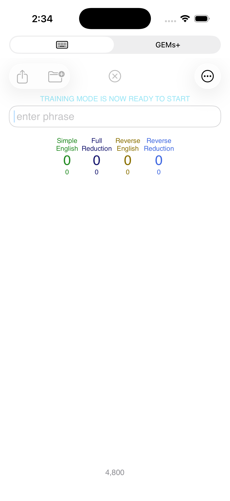
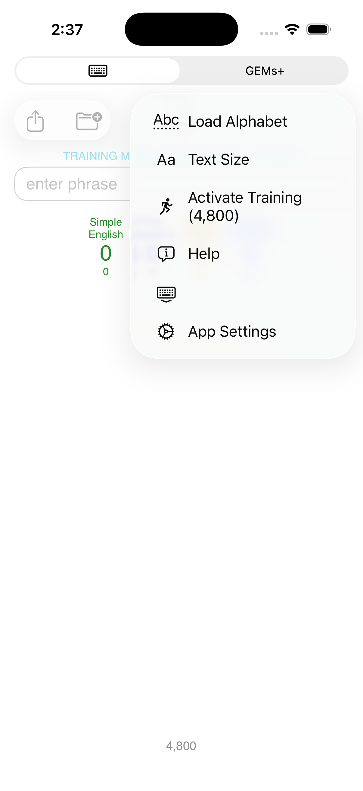

# n48calc

## -48 Calculator Help
> The -48 Calculator APP can store your Gematria Phrases locally on your personal mobile device if you choose to save phrases. You also have the option of not saving anything at all by never clicking on the SAVE Folder. If you do choose to save phrases, the phrases are stored on your device, and optionally in the Apple iCloud if you've enabled the iCloud SAVE/BACKUP feature for Apple APPS. Only you can see your phrases, they are not accessible by anyone else.
>
> Apple requires a Privacy policy for all APPS that are accepted into the App Store. The policy for the -48 Calculator, can be reviewed here: <a href='https://n48calculator.github.io/policy/' target='_blank'>-48 Calculator Policy Link</a>
>
> When the APP is launched for the first time, it starts up in a reduced functionality mode with many features disabled. A basic set of 4 ciphers are activated initially (a total of 18 ciphers are available in the App). Once 4800 phrases have been entered and saved, then you can enter a "training mode" assisting you in learning the various additional features of the Calculator App. Suggestions are made that are focused around you and your interests so that you can eventually see your own personal correlations in Gematria. However, you can choose to type in anything you want instead of the "prompt" suggestions during the training phase (some people are simply paranoid).

Once you've achieved/exceeded the GOAL of 4800 initial phrases saved, then the "LIGHT BLUE" message "TRAINING MODE IS NOT READY TO START" will appear just above the phrase entry text field. When this is presented, you are not automatically sent into "TRAINING MODE". Training Mode is entered when the User "activates" that mode using the 3-dots menu item "Activate Training (4,800)". Don't panic when your screen contents change, your 4800+ phrases are all still present in your database.

## *** IMPORTANT (APP Database Backup process) ***
>In order to BACKUP your personal database, there is an EXPORT utility feature available within the App. If you are still relatively new, and have less then 4800 phrases, you will need to type in a "TRIGGER CODE" to activate the EXPORT feature. If you have more than 4800 phrases and have completed TRAINING mode, then the feature is available without a "TRIGGER CODE" requirement. The number of phrases you have in your personal database is presented on your Calculator view/screen at the bottom, centered, and in "gray". You'll see this number increase every time you add a new phrase entry.
>
>The "TRIGGER CODE" for users without 4800 phrases is "BQQM!" (that's 5 characters in all capital letters, with an exclamation point, the double-quotes are not necessary). Once the code has been entered, the EXPORT utility will be made available. If you stop and restart your APP, then this will need to be re-entered again in the future whenever you desire to BACKUP again.
>
>The EXPORT utility is located on the [App Settings] view, which can be activated using the 3-dots (upper right corner of Calculator), then selecting the AppSettings menu item. Then locate the EXPORT "link" near the bottom, click on the "EXPORT" link presented.
>
>The [-48 Export] view is then presented, with any previous BACKUPS listed. To create a NEW/FRESH backup, click on the [+] icon located in the upper right of that App view. You should see a NEW backup file created and listed with "today's" DATE/TIME added to the list.
>
>That's all you need to do. However, it's probably also a good idea to COPY that backup to an external location (most Apple users have FREE iCloud space available). You can do this by first selecting the backup file in the list you wish to COPY externally by "clicking" on that file listed. Then with that file selected, click on the SQUARE-WITH-OUT-POINTING-ARROW icon in the upper-left. That will activate Apple's FILES App which will navigate you to SAVE your backup to anywhere within your own personal Apple EcoSystem desired. Navigate to the desired location, followed by a click of the SAVE button to complete the externalization procedure.
>
>NOTE: if you have more than 4800 phrases, and accidentally type in the "TRIGGER CODE" (it's not needed), then you will be switched/toggled back into TRAINING mode. If this happens accidentally, you can toggle back out of training by typing the "TRIGGER CODE" once again.

---

## Demonstration Videos

The following links are demonstration videos of the Calculator in operation geared for beginners. 

In the future, there will be LIVE training sessions for additional Feature demonstrations and for Q&A.

The demo videos can be found "**pinned**" to the TOP of following Calculator Development team personal page links.

### X (formally Twitter)
> <a href='https://x.com/captdanosara' target='_blank'>captdanosara =113</a>

> <a href='https://x.com/PenelopePi15850' target='_blank'>PenelopePi15850 =132</a>

### Telegram
> <a href='https://t.me/SmileLoveGematria/' target='_blank'>SmileLoveGematria =186</a>

> <a href='https://t.me/NonnieCodes/' target='_blank'>NonnieCodes =117</a>

> <a href='https://t.me/MRFOURSEVEN156/' target='_blank'>MR FOUR SEVEN =156</a>

### Rumble
> <a href='https://rumble.com/user/NEGATIVE48ISME' target='_blank'>NEGATIVE48ISME =141</a>

> <a href='https://rumble.com/v6w8czg--48-calculator-demo.html' target='_blank'>WHAT IS GEMATRIA =154</a>

### TikTok
> <a href='https://www.tiktok.com/@michaelprotzman' target='_blank'>MICHAEL PROTZMAN =174</a>

### Truth Social
> <a href='https://truthsocial.com/@Negative48' target='_blank'>NEGATIVE48 =95</a>
